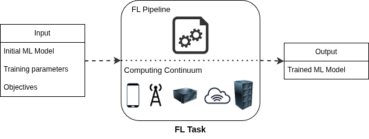
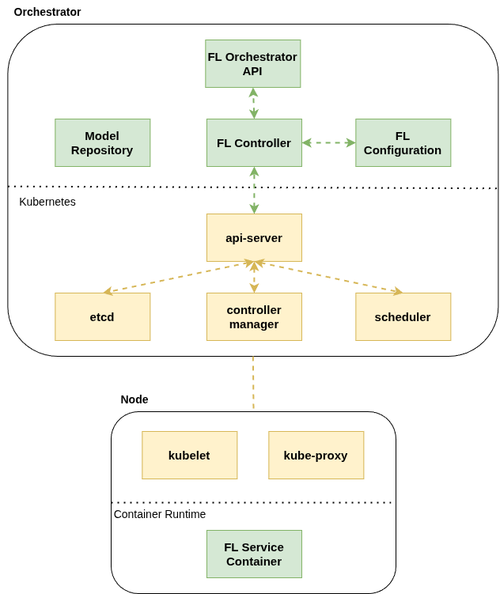

# AIoTwin FL Orchestrator

## About

This is a framework for adaptive orchestration of FL pipelines developed within the [AIoTwin](https://aiotwin.eu/) project. 
It is an extenstion of Kubernetes and deploys entities of the FL pipeline (clients and aggregators) as Kubernetes pods.
More details about the design and algorithms can be found in the paper [Reactive Orchestration for Hierarchical Federated Learning Under a Communication Cost Budget](https://arxiv.org/abs/2412.03385).

## Citation

BibTeX:

```bibtex
@misc{cilic2025reactivehflorch,
      title={Reactive Orchestration for Hierarchical Federated Learning Under a Communication Cost Budget}, 
      author={Ivan Čilić and Anna Lackinger and Pantelis Frangoudis and Ivana Podnar Žarko and Alireza Furutanpey and Ilir Murturi and Schahram Dustdar},
      year={2025},
      eprint={2412.03385},
      archivePrefix={arXiv},
      primaryClass={cs.DC},
      url={https://arxiv.org/abs/2412.03385}, 
}
```

## Framework design and architecture

The users of the framework define an FL task which consists of the inital ML model, training parameters and objectives (e.g. communication cost budget).
The framework then deploys the FL pipeline in the computing continuum and outputs the trained ML model.



The architecture of the framework is shown in the following figure. It the **FL controller** that deploys and monitors the pipeline, **FL configuration** that outputs the best-fit configuration for the pipeline and **Model Repository** that stores the model snapshots during runtime.
Orchestrator deploys the FL services (clients and aggregators) as Kubernetes pods on the nodes in the cluster.



## Installation and usage

### Prerequisites

1. Install Go version 1.20 or higher (https://go.dev/doc/install).

2. Deploy a Kubernetes (or K3s) cluster.

3. Copy your Kubernetes config YAML (usually in `~/.kube/config`) to `configs/cluster/kube_config.yaml`.

### Deployment

#### Actual infrastructure

1. Define FL node type (GA, LA, client) for each Kubernetes node through labels, like in `"scripts/set_labels.sh"`. Additionally, define communication cost between nodes and, for client nodes, total number of partitions and partition ID.

2. Start fl-orchestrator:

```bash
cd cmd/http
go run main.go
```

#### Simulated infrastructure

Simulated infrastructure means that it is defined in CSV files and not the actual infrastructure of Kubernetes cluster. With this option you can simulate multiple FL nodes on a single Kubernetes node to test your configurations and solutions.

1. Edit CSV's for initial config and changes. They are placed in `configs/cluster`.

The given example CSV's will configure experiment that starts with the environment defined in `cluster.csv` (1 GA, 2 LAs, 8 clients with 10 partitions) and after round 10 it appends the content of `changes.csv` to `cluster.csv` to trigger reconfiguration. Changes add additional two client.

2. Start fl-orchestrator as a simulation:

```bash
cd cmd/http
go run main.go sim
```

### Usage

#### FL task definition
FL task is defined throgh file `configs/fl/task.py`. You can see the example given in that file, or in `config/fl/examples`. The template file (`config/fl/task_template.py`) defines the functions and classes that have to be implemented:
- _Net_ - Pytorch nn.Module, a base class for neural network modules
- _get_weights_ - returns weights from Net model
- _set_weights_ - sets the weights of the model
- _load_data_ - loads training and test sets
- _train_ - defines how model is trained
- _test_ - defines how model is tested

#### Starting the FL pipeline
To start an FL pipeline, send a POST request (with curl or Postman) to `http://<NODE_IP>:8080/fl/start` (NODE_IP is the IP of the host that runs FL orchestrator). Example of a request:

```json
{
    "epochs": 2,
    "localRounds": 2,
    "trainingParams": {
        "batchSize": 128,
        "learningRate": 0.1
    },
    "configurationModel": "minCommCost",
    "modelSize": 3.3,
    "costConfiguration": {
        "costType": "totalBudget",
        "communicationBudget": 100000
    },
    "rvaEnabled": true
}
```

This deploys hierachical FL (HFL) where local epochs is set to 2, local rounds also set to 2, and using a configuration strategy "minCommCost" that clusters clients to minimize cost between clients and local aggregators. It defines that the model size is 3.3 MB, sets the total communication budget to 100 000 units, and enables RVA to be used by the orchestrator.
Also, it sets training parameters: learning rate and batch size.
